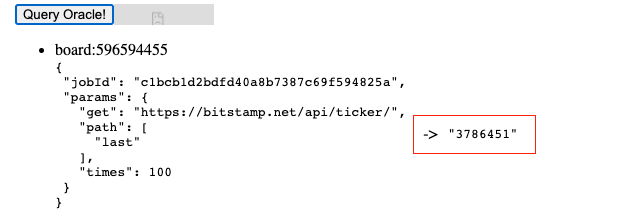
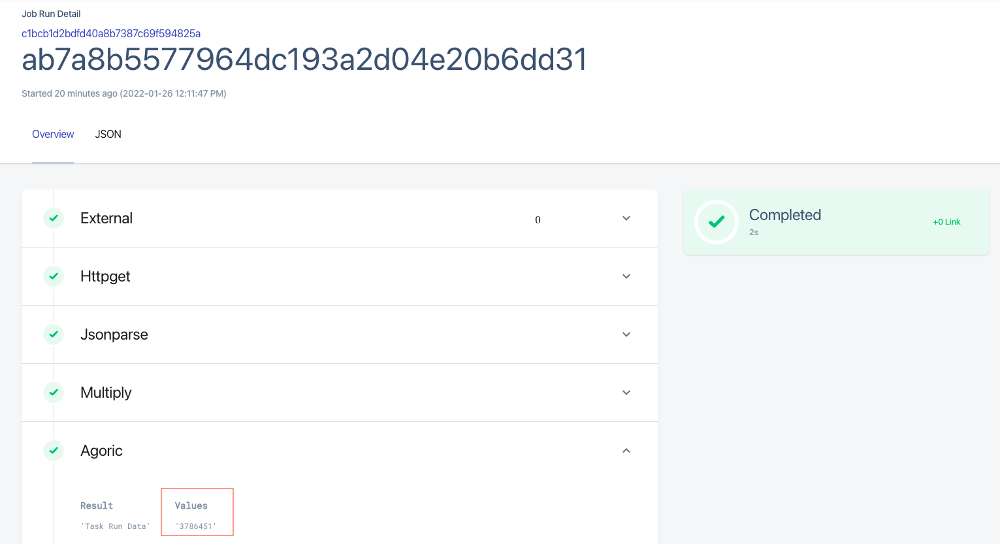

# Setup Guide

This is a step-by-step guide explaining how to set up a Chainlink node and an oracle on Agoric

## Requirements

Make sure you have the following requirements before starting:
1. node (Minimum version 14.15.0)
2. docker
3. docker-compose

## Step 1: Installing Agoric CLI

``` bash
node --version # 14.15.0 or higher
npm install --global yarn
git clone https://github.com/Agoric/agoric-sdk
cd agoric-sdk
yarn install
yarn build
yarn link-cli ~/bin/agoric
echo "export PATH=$PATH:$HOME/bin" >> ~/.profile
source ~/.profile
agoric --version
```

## Step 2: Change Network Config File

Change the IP in the file found in <b>chainlink-agoric/etc/network-config.json</b>

```json
{
  "chainName": "agoric",
  "gci": "http://<ip>:26657/genesis",
  "rpcAddrs": [
    "<ip>:26657"
  ]
}
```

## Step 3: Start a local chain

Before the setup, we have to start a local chain.

```bash
#run this in the root directory of this project
agoric start local-chain &> chain.log &
```

## Step 4: Run setup script

The next step involves running the script found at <b>chainlink-agoric/setup</b>.

```bash
#run this in the root directory of this project
cd chainlink-agoric
./setup
```

This setup script does the following:
1. Starts docker containers via <b>chainlink-agoric/internal-scripts/common.sh</b> for:
    - Postgres DB Instance
    - Chainlink Node
    - Agoric local solo node to interact with the chain started in Step 3
    - Chainlink Agoric External Adapter
    - Chainlink Agoric External Initiator
2. Creates an Oracle with a dApp via <b>chainlink-agoric/internal-scripts/add-dapp-oracle.sh</b> which does the following:
    - Transferscoins to the ag-solo node
    - Installs the dapp-oracle contract
    - Adds the dapp-oracle to the Agoric nod
3. Adds the external initiator to the Chainlin knode via <b>chainlink-agoric/internal-scripts/add-ei.sh</b>
4. Adds the external adapter to the bridges section of the Chainlink node via <b>chainlink-agoric/internal-scripts/add-bridge.sh</b>
5. Adds a jobspec to the Chainlink node via <b>chainlink-agoric/internal-scripts/add-jobspec.sh</b>

## Step 5: Record the output

The setup script from the previous step returns an output of this format

```
board:<board_num> jobId:"<job_id>" ?API_URL=http://localhost:6891 CL=http://localhost:6691
```

Store this somewhere but if it is lost, this can be obtained by running

```bash
#run this in the root directory of this project
cd chainlink-agoric
node show-jobs.js
```


## Step 6: Log in the Chainlink node

1. Head to either:
    - <b>http://localhost:6691</b> (If from the same VM)
    - <b>http://<vm_ip>:6691</b> (If remotely)
2. Login with
```
Email: notreal@fakeemail.ch
Password: twochains
```

#### Step 6A: Confirm that a job exists

a) Head to Jobs
b) Make sure there is a job

</img>

#### Step 6B: Confirm there is a bridge

a) Head to Bridges
b) Make sure there is a bridge

</img>

## Step 7: Start Oracle dApp UI

```bash
#run this in the root directory of this project
cd ui
yarn install
yarn start
```

Check the UI at either
    - <b>http://localhost:3000?API_URL=http://<ag_solo_ip>:6891</b> (If from the same VM)
    - <b>http://<vm_ip>:3000?API_URL=http://<ag_solo_ip>:6891</b> (If remotely)

</img>

#### Step 7A: Change board

Change the board number to the board number obtained from Step 5

</img>

#### Step 7B: Change jobId 

Change jobId from the job ID obtained from Step 5

</img>

## Step 8: Executing a Job Run

Let's assume we got back this output from Step 5

```
board:596594455 jobId:"c1bcb1d2bdfd40a8b7387c69f594825a ?API_URL=http://localhost:6891 CL=http://localhost:6691
```

#### Step 8A: Fill in query details

To run a job sepc, in the dApp UI we enter the aforementioned values as explained in Steps 7A and 7B and then hit <b>Query Oracle!</b> as can be seen in the image below

</img>

#### Step 8B: Wait for Query and Reply

After pressing <b>Query Oracle!</b>, you should be able to see the result as waiting

</img>

Then, you should press <b>Reply and Collect</b> to reply the result to the node as below

</img>

Finally, you should be able to view the result which should replace the text <b>Waiting...</b> as below

</img>

#### Step 8C: Check Job Run on Chainlink Node

1. Login like in Step 6 and head to Jobs
2. Click on Jobs
3. Choose the job with the ID entered in the query in Step 7B
4. Click on the last job run
5. Confirm that the value matches the one shown in Step 8B
</img>

## Step 9: Creating a Scheduled Job Run

##### Step 9A: Create a Push Notifier

1. Head to the Oracle dApp UI as in Step 7
2. Click on <b>Create Push Query</b> as below

</img>

3. Take note of the Notifier board and queryId as below

</img>

#### Step 9B: Log in to the Chainlink Node and add a scheduled job

1. Log in the Chainlink Node like Step 6
2. Go to Jobs
3. Click <b>New Job</b>
4. Paste in the following job and replace <b><query_id></b> with the queryId from the previous step having the format <b>push-x</b>. This job runs automatically every 1 minute.

```json
{
  "initiators": [
    {
      "type": "cron",
      "params": {
          "schedule": "CRON_TZ=UTC */1 * * * *"
      }
    }
  ],
  "tasks": [
    {
      "type": "HTTPGet",
      "confirmations": 0,
      "params": { "get": "https://bitstamp.net/api/ticker/" }
    },
    {
      "type": "JSONParse",
      "params": { "path": [ "last" ] }
    },
    {
      "type": "Multiply",
      "params": { "times": 100 }
    },
    {
      "type": "Agoric",
      "params": {
        "request_id": "<query_id>",
        "payment": "0"
      }
    }
  ]
}
```

5. Click <b>Create Job</b>

#### Step 9C: Confirm Job Runs are running

1. Go to Jobs
2. Click on the most recent job by looking at the created date
</img>
3. Confirm there are job runs
</img>
4. You should also see the latest value being changed here
</img>

#### Step 9D: Open the ag-solo node REPL

1. Go to the VM where the docker containers are running, more specifically where the ag-solo node is running
2. Run the following to open the UI to interact with the node

```bash
agoric open --repl --hostport=127.0.0.1:6891
```
3. Check the UI at either
    - <b>http://localhost:6891</b> (If from the same VM)
    - <b>http://<vm_ip>:6891</b> (If remotely)

</img>

#### Step 9E: Run this command to get the latest pushed price

Run this command to get the latest pushed price. You need to replace <b><board_id></b> with the notifier board ID from Step 9A.3

```js
E(E(agoric.board).getValue("<board_id>")).getUpdateSince()
```

In the image below, you can see the latest value being pushed

</img>
